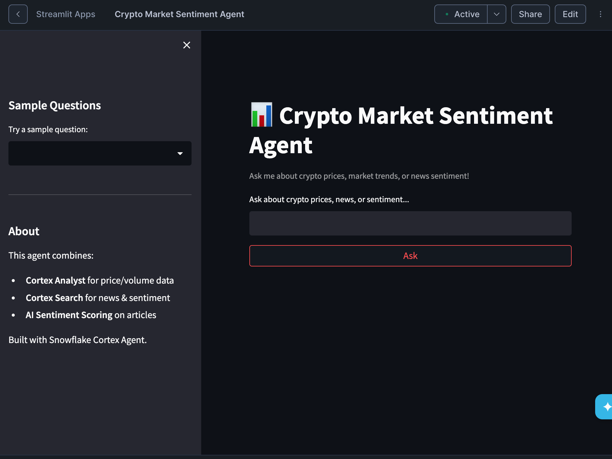

# 📊 Crypto Market Sentiment Agent

An end-to-end Agentic AI application built on **Snowflake Cortex** that combines real-time cryptocurrency market data with AI-powered news sentiment analysis. Ask questions in plain English and get intelligent, data-driven answers.

## 🏗️ Architecture

══════════════════════════════════════════════════════════════
                    DATA INGESTION
══════════════════════════════════════════════════════════════

  CoinGecko API          HackerNews API
  (crypto prices)        (tech articles)
       │                      │
       └──────┐    ┌──────────┘
              ▼    ▼
        Python Data Loader
        (MERGE / upsert)

══════════════════════════════════════════════════════════════
                      SNOWFLAKE
══════════════════════════════════════════════════════════════

  ┌─────────────────────┐    ┌─────────────────────────────┐
  │  CRYPTO_PRICES      │    │  TECH_NEWS                  │
  │  (structured data)  │    │  (unstructured + sentiment) │
  └────────┬────────────┘    └─────────────┬───────────────┘
           │                               │
           ▼                               ▼
  ┌─────────────────────┐    ┌─────────────────────────────┐
  │  Semantic View      │    │  Cortex Search Service      │
  │  (schema/metrics)   │    │  (full-text + vector search)│
  └────────┬────────────┘    └─────────────┬───────────────┘
           │                               │
           └──────────┐    ┌───────────────┘
                      ▼    ▼
              ┌──────────────────┐
              │  Cortex Agent    │
              │  (orchestrator)  │
              └────────┬─────────┘
                       │
                       ▼
              ┌──────────────────┐
              │  Streamlit App   │
              │  (chat UI)       │
              └──────────────────┘

══════════════════════════════════════════════════════════════
