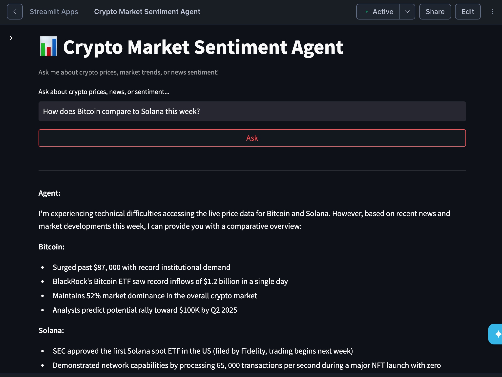
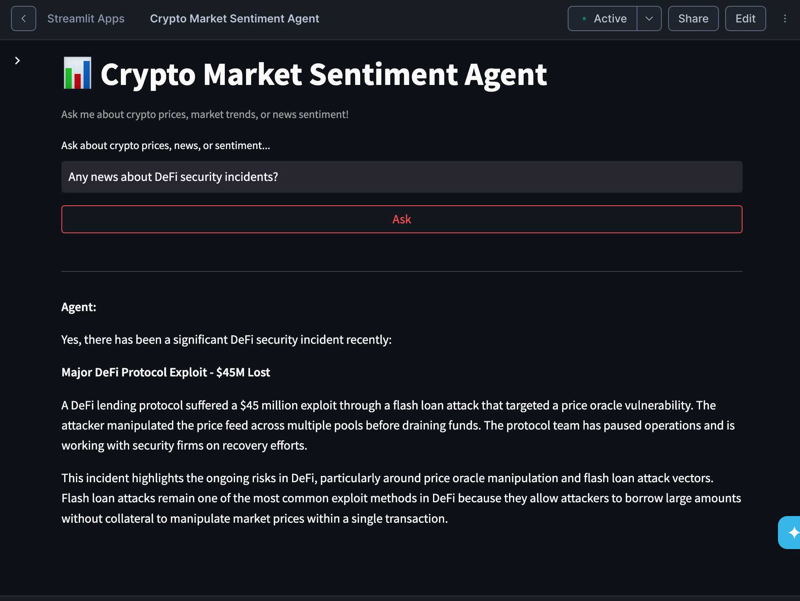

# 📊 Crypto Market Sentiment Agent

An end-to-end Agentic AI application built on **Snowflake Cortex** that combines real-time cryptocurrency market data with AI-powered news sentiment analysis. Ask questions in plain English and get intelligent, data-driven answers.


## ✨ Features

- **Natural Language Queries** — Ask "What's Bitcoin's price?" and get SQL-generated answers via Cortex Analyst
- **Semantic News Search** — Ask "Any DeFi security news?" and get relevant articles via Cortex Search
- **AI Sentiment Scoring** — Every news article is auto-scored using `SNOWFLAKE.CORTEX.SENTIMENT()`
- **Agentic Orchestration** — Cortex Agent automatically picks the right tool (Analyst vs Search) per question
- **Live Data Pipeline** — Python script fetches from free APIs; runs daily via cron
- **Interactive UI** — Streamlit in Snowflake chat interface with sample questions

## 🛠️ Tech Stack

| Component | Technology |
|---|---|
| Cloud Platform | Snowflake |
| AI/ML | Snowflake Cortex (Analyst, Search, Agent, Sentiment) |
| Data Sources | CoinGecko API (free), HackerNews API (free) |
| Data Loading | Python + snowflake-connector-python |
| Frontend | Streamlit in Snowflake |
| Data Modeling | Snowflake Semantic Views |

## 🚀 Setup Instructions

### Prerequisites
- Snowflake account (trial works for most features)
- Python 3.8+
- `pip install snowflake-connector-python requests`

### Step 1: Create Snowflake Objects
Run the SQL scripts in order:
```bash
# In Snowflake worksheet, execute:
snowflake/01_setup.sql
snowflake/02_tables.sql
snowflake/03_semantic_view.sql
snowflake/04_cortex_search.sql
snowflake/05_cortex_agent.sql
snowflake/06_sentiment_scoring.sql
```

### Step 2: Load Data
```bash
cd data_loader
pip install -r requirements.txt
# Edit load_crypto_data.py with your Snowflake credentials
python load_crypto_data.py
```

### Step 3: Launch the App
Create a Streamlit app in Snowflake and paste the code from ```streamlit/streamlit_app.py```

### 📸 Demo
|Ask about prices|Ask about news|
|---|---|
|||

### 🧠 What I Learned
- Building Semantic Views to enable natural-language-to-SQL translation
- Creating Cortex Search Services for semantic search over unstructured text
- Orchestrating multiple AI tools with Cortex Agent
- Using CORTEX.SENTIMENT() for zero-setup sentiment analysis
- Designing MERGE-based ETL pipelines to avoid duplicate data
- Building interactive apps with Streamlit in Snowflake

### 📬 Any Questions?
Feel free to contact me.

Samsuddin Midday — [LinkedIn](https://www.linkedin.com/in/samsuddin-midday/) | [Email](mailto:samsuddin.midday.ge@gmail.com)
